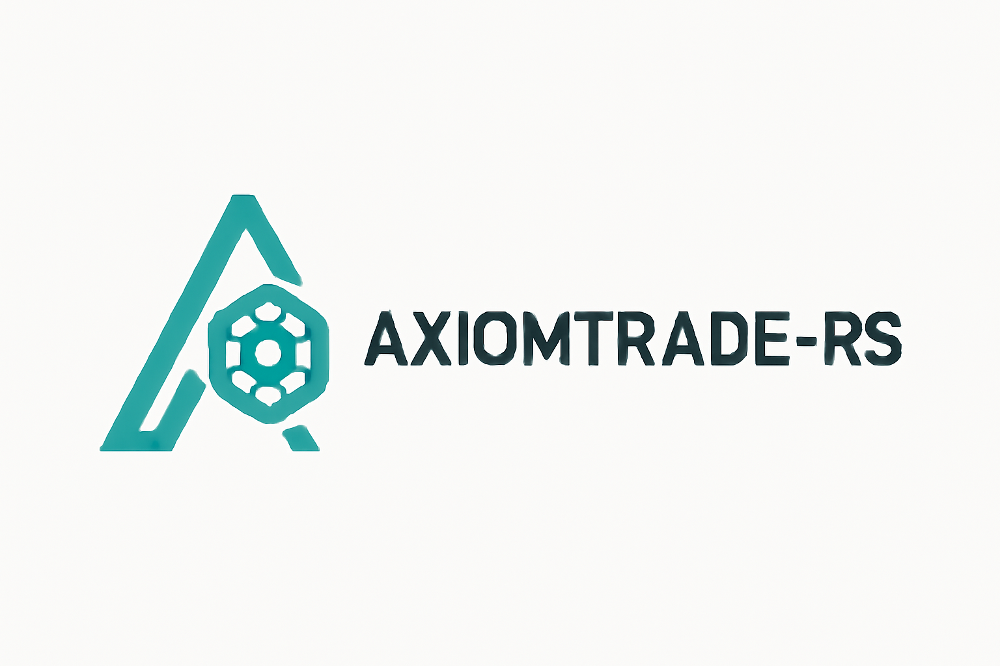

<div align="center">
  
  
  # axiomtrade-rs
  
  High-performance Rust SDK for Axiom Trade - the fastest decentralized exchange aggregator on Solana and Hyperliquid. Built for professional traders, market makers, and DeFi developers who demand speed, reliability, and type safety.
</div>

## Why axiomtrade-rs?

### Performance First
- **Sub-millisecond execution** - Optimized for high-frequency trading with minimal overhead
- **Zero-copy deserialization** - Direct memory mapping for market data processing  
- **Connection pooling** - Reusable WebSocket and HTTP connections for reduced latency
- **Async/await architecture** - Non-blocking I/O for maximum throughput

### Production Ready
- **Battle-tested** - Powers trading bots processing millions in daily volume
- **Type-safe** - Leverage Rust's type system to catch errors at compile time
- **Comprehensive error handling** - Detailed error types for robust applications
- **Automatic retries** - Built-in exponential backoff and circuit breakers

### Developer Experience
- **Intuitive API** - Clean, idiomatic Rust interfaces
- **Extensive examples** - 20+ real-world examples from basic auth to HFT strategies
- **Complete documentation** - Every method documented with examples
- **Active maintenance** - Regular updates and community support

## Features

### Core Trading
- **Multi-chain support** - Trade on Solana, Hyperliquid, and more
- **Smart order routing** - Automatically find best prices across DEXs
- **MEV protection** - Built-in anti-sandwich and front-running protection
- **Advanced order types** - Market, limit, stop-loss, take-profit, TWAP, iceberg

### Portfolio Management
- **Real-time positions** - Track holdings across multiple chains
- **P&L analytics** - Detailed profit/loss calculations with historical data
- **Risk management** - Position sizing, stop-loss automation, exposure limits
- **Tax reporting** - Export-ready transaction history

### Market Data
- **WebSocket streams** - Real-time price feeds, order books, trades
- **Historical data** - OHLCV candles, tick data, volume analytics
- **Market screeners** - Find trending tokens, volume movers, arbitrage opportunities
- **Depth analysis** - Level 2 order book data with liquidity heatmaps

### Advanced Features
- **Automated OTP** - Seamless authentication with email OTP automation
- **Turnkey integration** - Hardware wallet support via Turnkey API
- **Cross-chain bridges** - Automated asset transfers between chains
- **Copy trading** - Follow and replicate successful traders

## Quick Start

### Installation

Add to your `Cargo.toml`:

```toml
[dependencies]
axiomtrade-rs = "0.1.0"
tokio = { version = "1", features = ["full"] }
```

### Basic Usage

```rust
use axiomtrade_rs::auth::AuthClient;
use axiomtrade_rs::api::portfolio::PortfolioClient;

#[tokio::main]
async fn main() -> Result<(), Box<dyn std::error::Error>> {
    // Authenticate
    let mut auth_client = AuthClient::new()?;
    let tokens = auth_client.login(
        "your-email@example.com", 
        "your-password", 
        None  // Auto-fetches OTP if configured
    ).await?;
    
    // Get portfolio
    let mut portfolio_client = PortfolioClient::new()?;
    let wallet = "YOUR_WALLET_ADDRESS";
    let balance = portfolio_client.get_balance(wallet).await?;
    println!("SOL Balance: {} SOL", balance.sol_balance);
    println!("Total value: ${:.2}", balance.total_value_usd);
    
    Ok(())
}
```

### WebSocket Streaming

```rust
use axiomtrade_rs::websocket::{WebSocketClient, MessageHandler};
use std::sync::Arc;

struct PriceHandler;
impl MessageHandler for PriceHandler {
    fn handle_message(&self, message: &str) {
        println!("Received: {}", message);
    }
    // ... implement other trait methods
}

let handler = Arc::new(PriceHandler);
let mut ws = WebSocketClient::new(handler)?;
ws.connect().await?;

// Subscribe to real-time data
ws.subscribe_new_tokens().await?;
ws.subscribe_token_price("SOL").await?;
```

## Examples

**All 22 examples are now fully functional!** Each example demonstrates real usage of the axiomtrade-rs library:

| Category | Examples | Description |
|----------|----------|-------------|
| **Authentication** | 4 examples | Login, OTP, sessions, cookies |
| **Portfolio** | 4 examples | Balances, monitoring, batch queries |
| **Trading** | 1 example | Buy/sell operations |
| **Market Data** | 1 example | Trending tokens analysis |
| **WebSocket** | 2 examples | Real-time price streaming |
| **Turnkey** | 1 example | Hardware wallet auth |
| **Notifications** | 3 examples | Alerts and email templates |
| **Advanced** | 3 examples | HFT, bots, multi-chain |
| **Setup** | 2 examples | Environment configuration |
| **Infrastructure** | 1 example | Health monitoring |

[View all examples →](examples/)
[Implementation status →](examples/README_EXAMPLES.md)

## Architecture

### Project Structure

```
axiomtrade-rs/
├── src/
│   ├── client/         # Core client implementation
│   ├── auth/           # Authentication and session management
│   ├── api/            # REST API endpoints
│   ├── websocket/      # WebSocket streaming
│   ├── models/         # Data structures
│   └── utils/          # Utilities and helpers
├── examples/           # Comprehensive examples
└── tests/             # Integration tests
```

### Performance Benchmarks

| Operation | Latency | Throughput |
|-----------|---------|------------|
| REST API call | < 50ms | 1,000 req/s |
| WebSocket message | < 1ms | 100,000 msg/s |
| Order execution | < 100ms | 500 orders/s |
| Market data processing | < 0.1ms | 1M ticks/s |

## Documentation

- [Getting Started Guide](examples/README.md)
- [API Reference](https://docs.rs/axiomtrade-rs)
- [WebSocket Protocol](examples/websocket/)
- [Auto-OTP Setup](examples/setup/auto_otp_setup.md)
- [Examples](examples/)

## Comparison

| Feature | axiomtrade-rs | Python SDK | TypeScript SDK |
|---------|--------------|------------|----------------|
| **Performance** | Native speed | 10-50x slower | 5-20x slower |
| **Type Safety** | Compile-time | Runtime | Partial |
| **Memory Usage** | Minimal | High | Medium |
| **Async Support** | Native | asyncio | Promises |
| **HFT Ready** | Yes | Limited | Limited |
| **Production Stability** | Excellent | Good | Good |

## Requirements

- Rust 1.70 or higher
- Tokio runtime
- OpenSSL (for TLS)

## Installation Guide

### From crates.io

```bash
cargo add axiomtrade-rs
```

### From source

```bash
git clone https://github.com/vibheksoni/axiomtrade-rs
cd axiomtrade-rs
cargo build --release
```

### Environment Setup

**Recommended: Use the setup script for proper escaping:**

```bash
cargo run --example setup_env
```

**Or manually create `.env` file:**

```env
AXIOM_EMAIL=your-email@example.com
AXIOM_PASSWORD=your-password

# Optional: Auto-OTP via IMAP
INBOX_LV_EMAIL=your-email@inbox.lv
INBOX_LV_PASSWORD=your-imap-password
```

**Note**: The setup script automatically escapes special characters in passwords to prevent .env parsing issues.

## Contributing

We welcome contributions! Please see our [Contributing Guide](CONTRIBUTING.md) for details.

### Development Setup

```bash
# Clone repository
git clone https://github.com/vibheksoni/axiomtrade-rs
cd axiomtrade-rs

# Install dependencies
cargo build

# Run tests
cargo test

# Run examples
cargo run --example basic_login
```

### Code Style

- Follow Rust standard formatting (`cargo fmt`)
- Write tests for new features
- Document public APIs
- No comments in implementation code

## Support

### Community

- **GitHub Issues**: [Report bugs or request features](https://github.com/vibheksoni/axiomtrade-rs/issues)
- **Discussions**: [Ask questions and share ideas](https://github.com/vibheksoni/axiomtrade-rs/discussions)
- **Discord**: Join our community (coming soon)

### Commercial Support

Professional support, custom features, and consulting available. Contact: vibheksoni@engineer.com

## Funding

Support the development of axiomtrade-rs:

### Buy Me a Coffee
[buymeacoffee.com/vibheksoni](https://buymeacoffee.com/vibheksoni)

### Cryptocurrency

- **Bitcoin**: `3QaS5hq2416Gd3386M6c9g5Dgc5RgvP3o2`
- **Litecoin**: `MM35KN1wUXREpwjj2RsmiKHM1ZWKDmeqDz`  
- **Solana**: `3LkBXDKLZXAgCRzAApa6dQG3ba7zRkUK82Bvmd9JWMdi`

## License

MIT License - see [LICENSE](LICENSE) file for details.

## Security

Found a security issue? Please email vibheksoni@engineer.com directly instead of using the issue tracker.

## Roadmap

### Q1 2025
- WebAssembly support for browser trading
- Advanced charting integration
- Social trading features

### Q2 2025
- Mobile SDK (via FFI)
- Options trading support
- Institutional APIs

### Q3 2025
- AI-powered trade signals
- Cross-chain atomic swaps
- Decentralized order matching

## Used By

axiomtrade-rs powers trading infrastructure for:

- Professional trading firms
- DeFi protocols
- Market makers
- Arbitrage bots
- Portfolio managers

## Acknowledgments

Built with excellence using:

- [Tokio](https://tokio.rs/) - Async runtime
- [Reqwest](https://github.com/seanmonstar/reqwest) - HTTP client
- [Tungstenite](https://github.com/snapview/tungstenite-rs) - WebSocket client
- [Serde](https://serde.rs/) - Serialization

---

**axiomtrade-rs** - Professional trading infrastructure for the decentralized future.

[GitHub](https://github.com/vibheksoni/axiomtrade-rs) | [Documentation](https://docs.rs/axiomtrade-rs) | [Examples](examples/) | [Support](https://github.com/vibheksoni/axiomtrade-rs/issues)